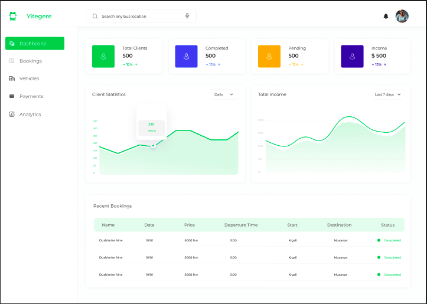

# MoveSmart 

Company Dashboard



- Node.js 18.x or later (recommended to use Node.js 20.x or later)

### Cloning the Repository

Clone the repository using the following command:

```bash
git clone https://github.com/Rukundo-Bahati/MoveSmart-company.git
```

> Windows Users: place the repository near the root of your drive if you face issues while cloning.

1. Install dependencies:

   ```bash
   npm install
   # or
   yarn install
   ```

   > On `npm` some included packages can cause peer-deps issue with React 18 while installing.
   >
   > Use the `--legacy-peer-deps` flag, at the end of the installation command, as a workaround for that.

2. Start the development server:
   ```bash
   npm run dev
   # or
   yarn dev
   ```
